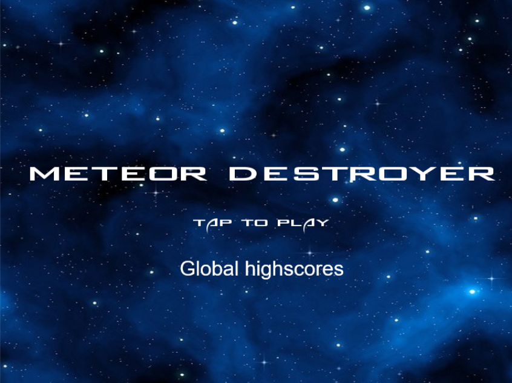
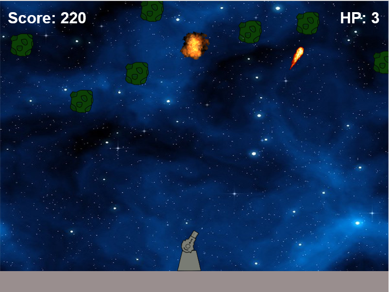
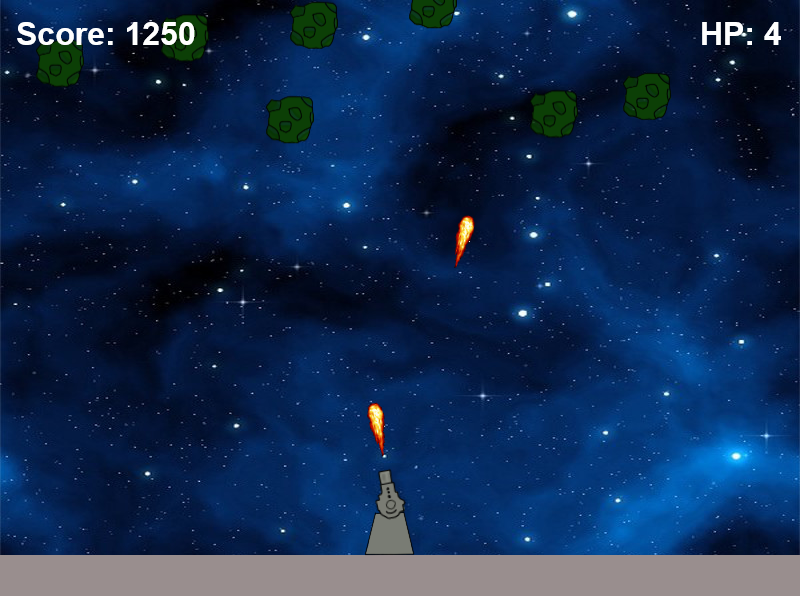
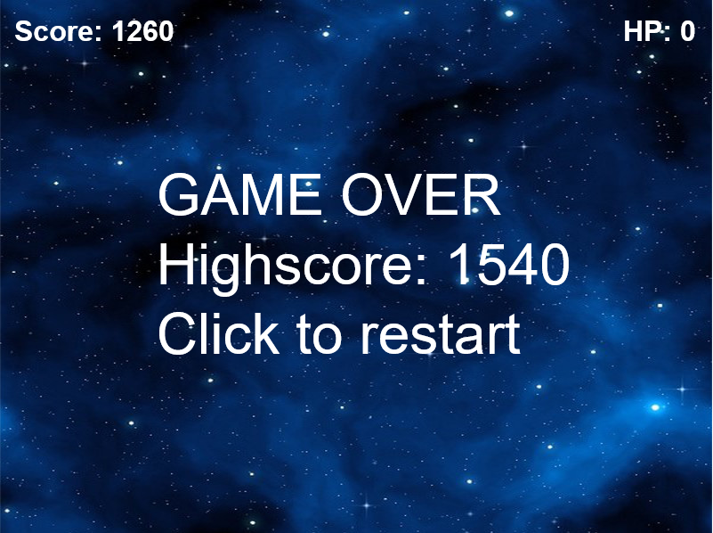

# Meteor Destroyer

A simple arcade HTML5 and JavaScript game made with Phaser framework.

You play as a small cannon turret which must face and endless meteor rain falling upon your space base.

How many meteors will you blow up before they can hit and destroy your base? How long will you endure the meteor rain?

## Instructions
1. Click anywhere in the start screen to start the game
2. Wait it for load (it needs some seconds to load the music theme in some browsers).
3. Aim at any point of the screen with your mouse over the turret and click to fire the bullets to the falling meteors. If you are playing the game from a mobile
device, just click with your finger tip at any point of the screen over the turret to fire.
4. Destroy all the falling meteors until you lose all your "lives" or HP. If you want to restart the game, just click anywhere in the screen.

## Gameplay notes
- You start with a default number of 3 "lives" or HP points.
- Each destroyed meteor gives 10 score points.
- For each 1000 scored points you win one extra life.
- To pause the game just move your pointer (mouse pointer or finger tip in a mobile device) out of the game canvas. To unpause, you only have to return the 
pointer within the game canvas and click.

## Screenshots

## Play it!

Just open this link to test and play the game: 

[Meteor Destroyer](http://meteor-destroyer.herokuapp.com/)

##Credits

The turret, platform and meteor sprites were all done by me. 

The background picture, the explosion animation and bullet sprites are files belonging to the freely available [Phaser Examples Github repository](https://github.com/photonstorm/phaser-examples).

The music theme is one of 1990 NES's Silver Surfer stage themes composed by Tim and Geoff Follin.

The cannon fire and explosion sound effects are from 1998 Blizzard's Starcraft.

##Documentation

Here I list some useful tutorials, Q&A and similar projects which helped me to develop this game: 

- [Phaser Examples Github repository](https://github.com/photonstorm/phaser-examples)
- [Getting Started with Phaser](http://phaser.io/tutorials/getting-started)
- [How to have mouse down true only once each click? ](http://www.html5gamedevs.com/topic/1698-how-to-have-mouse-down-true-only-once-each-click/)
- [Create a High Score with Phaser?](http://www.html5gamedevs.com/topic/22749-create-a-high-score-with-phaser/)

